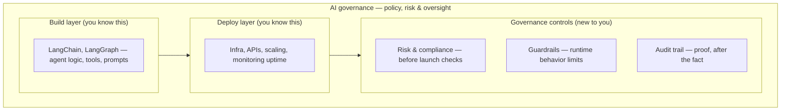
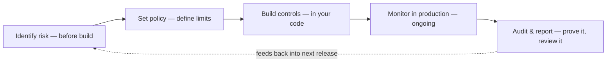
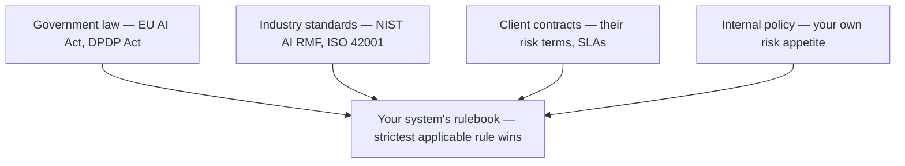
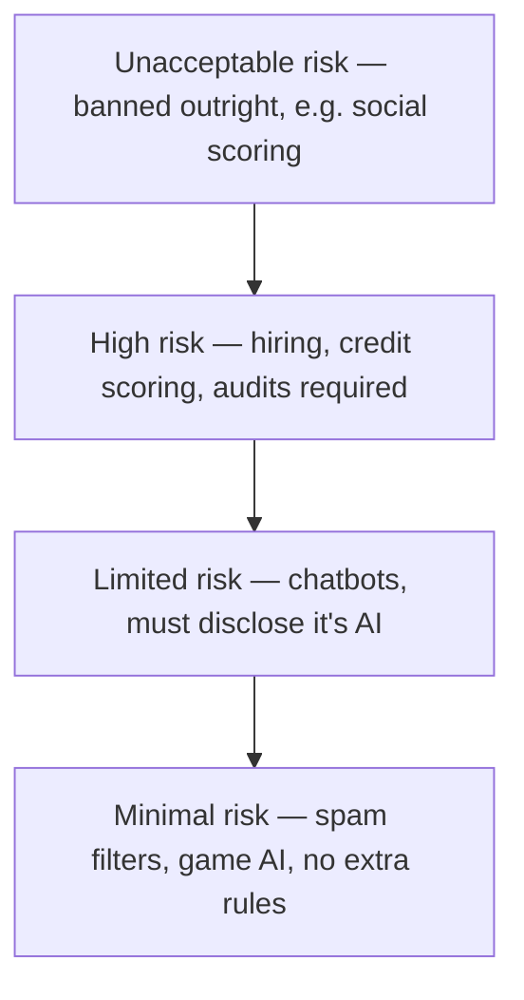

# AI Governance — full conversation transcript

---

## Q1: what exactly is AI governance, where it fits, why/what/who/when/how

### What AI governance actually is (in one line)

Think of it like this: you know how to build a car (agents), and you know how to build roads and get the car on the highway (deployment). AI governance is the traffic rules, the driving license, the insurance, the speed cameras, and the accident investigation team — all the stuff that makes sure the car doesn't hurt anyone, doesn't get stolen, and can be trusted by everyone else using the road.

It's not a technology. It's the set of rules, processes, and checks that decide: *can this AI system be built, how should it behave, who's allowed to touch it, and what happens when it goes wrong.*

Let me show you where it sits relative to the stack you already know.

So the key insight: **build and deploy are what you already do. Governance doesn't replace or sit inside those — it wraps around the whole thing**, from before you write the first line of agent code to long after it's running in production.

### The five questions (what, why, who, when, how)

**What is it?**
A set of policies, checks, and controls that decide how an AI system is allowed to behave, who's accountable for it, and how you prove it's trustworthy. Same idea as financial governance (why companies have auditors) or food safety governance (why restaurants get health inspections) — except the "product" here is a system that makes decisions on its own.

**Why does it exist?**
Because an agent you build with LangGraph can call tools, spend money, send emails, deny a loan, or leak data — all on its own, at machine speed. Without governance, nobody knows: did this agent do the right thing, can we explain why it did that, and who's responsible when it doesn't. Governance is what turns "trust me, the code works" into "here's proof it works, and here's what happens if it doesn't."

**Who's involved?**
Not just engineers. Think of it as a committee: legal/compliance (is this legal in this country), risk teams (what's the worst that can happen), business/product (does this match our values), and you, the builder (can I actually implement these constraints in code). You already build the car — governance adds the traffic authority, the insurance company, and the licensing board into the loop.

**When does it kick in?**
Before you build (deciding if the use case is even allowed — e.g. an AI making final hiring decisions is illegal in some places), during build (baking in guardrails, logging, human-approval steps), and after deployment (ongoing monitoring, incident response, periodic re-review). It's not a one-time gate — it's continuous.

**How is it actually implemented?**
This is the part that'll feel familiar to you as a builder — governance turns into concrete technical asks: input/output filters, human-in-the-loop approval nodes in your LangGraph graph, logging every tool call for audit, rate-limiting sensitive actions, bias testing before launch, and versioned model cards. Let me show you the lifecycle this actually follows.

### Bringing it back to what you know

Map each stage to your world:

- **Identify risk / set policy** — before you even open LangGraph, someone (maybe you, maybe a compliance person) decides: can this agent make irreversible actions (send money, delete data)? Does it touch personal data? Does it need a human to approve high-stakes steps?
- **Build controls** — this is where your engineering skills plug straight in: add a human-approval node in your LangGraph graph before a risky tool call, log every tool call with inputs/outputs, add input validation to block prompt injection, cap what tools the agent can call based on context.
- **Monitor in production** — same instinct as your deployment monitoring, but instead of just "is it up," you're tracking "is it behaving as approved" — drift in outputs, unexpected tool usage, bias in decisions.
- **Audit & report** — proving after the fact that the system did what it was supposed to. This is the part most engineers skip, and it's exactly what regulations like the EU AI Act are starting to demand.

The mental shift is this: as a builder you optimize for "does it work." Governance adds a second question that never goes away: **"can we prove it's safe, fair, and accountable — to a regulator, a customer, or an angry user — after the fact?"**

That's the whole field in a nutshell. Want me to go deeper into any one piece next — like the actual global regulations (EU AI Act, NIST AI RMF), or how to practically bake guardrails and audit logging into a LangGraph agent?

---

## Q2: on what basis are these rules/policies defined — regulations, client requirements, or what — and explain the acts

### Where do these rules actually come from?

They're not invented out of thin air. Four different sources push requirements down onto whatever agent you're building — and usually you have to satisfy all four at once, not just one.

A simple way to think about the difference: **government law is the floor you can't go below**, **industry standards are the proof you show others you're above the floor**, **client contracts are extra promises for one specific deal**, and **internal policy is you deciding to hold yourself to a higher bar than anyone's forcing on you**.

Now let's go through the actual acts and frameworks one at a time.

### 1. EU AI Act — the big one everyone references

This is the world's first comprehensive AI law, and its core idea is simple: **not all AI is equally dangerous, so don't regulate it all the same way.** It sorts every AI system into a risk tier, and the tier decides how much paperwork and control you need.

A quick but important note on timing: the EU AI Act entered into force in August 2024 and rolls out in stages. Enforcement of the general-purpose AI model rules and the chatbot "you're talking to an AI" disclosure rule begins on August 2, 2026. The high-risk system rules (the ones affecting things like hiring or credit scoring) were originally due the same date, but a recent set of amendments has pushed high-risk obligations for standalone systems like recruitment or credit scoring to December 2027, and for AI embedded in regulated products like medical devices to August 2028. So if a client asks "are we EU AI Act compliant," the honest answer depends heavily on which date and which tier you're talking about.

### 2. NIST AI RMF — the US "how-to" framework

Where the EU AI Act is a law with fines, NIST's AI Risk Management Framework is more like a **best-practices playbook** — voluntary, US-government-published, and built around four simple actions: **Govern** (set up policy and accountability), **Map** (understand the risks of your specific use case), **Measure** (test and quantify those risks), **Manage** (put controls in place and keep monitoring). No penalties for skipping it, but it's become the de facto checklist many US companies and their vendors expect each other to follow.

### 3. ISO/IEC 42001 — the certifiable standard

This is the AI equivalent of ISO 9001 (quality) or ISO 27001 (security) that you've probably seen client contracts reference. It's a **management system standard** — meaning it doesn't say "your model must be 95% accurate," it says "you must have a documented, repeatable process for managing AI risk." Companies get audited and certified against it, and increasingly, **clients ask for this certificate as proof before they'll sign a deal** — this is that "client requirement" box from the diagram above in action.

### 4. India — the one most relevant to you

Since you're building in India, this is the stack that actually applies to you day to day:

- **India AI Governance Guidelines** — released at the AI Impact Summit in February 2026, this is a principle-based framework built around seven guiding ideas: trust, people-first governance, innovation over restraint, fairness and equity, accountability, understandability by design, and safety and resilience. Notably, India has decided a separate standalone AI law isn't needed right now — instead existing laws are extended to cover AI, with new bodies like an AI Governance Group and an AI Safety Institute set up to coordinate enforcement.
- **DPDP Act (Digital Personal Data Protection Act)** — this is the one with real teeth for builders: it prohibits scraping or using personal data to train LLMs or neural networks without explicit, unambiguous consent, with real financial penalties for skipping this. If your agent touches user data at all, this is your first checkpoint.
- **IT Amendment Rules 2026** — notified in February 2026, this specifically targets AI-generated content that looks real (deepfakes, synthetic media), requiring visible labelling, provenance markers, and a strict takedown window — 3 hours for unlawful synthetic content, shrinking to 2 hours for non-consensual explicit material — or platforms lose their legal safe-harbour protection.

### How this maps back to your world

If you're building an agent for an Indian company, your actual rulebook looks like: **DPDP Act** for anything touching personal data → **India AI Governance Guidelines** for the broader risk/fairness/transparency expectations → **client contract** if they specifically demand ISO 42001 certification or NIST alignment → and **EU AI Act** only if that agent will ever touch an EU user or EU company's data, in which case the risk-tier diagram above decides how heavy the obligations get.

Want me to go one level deeper — like how to actually translate a specific regulation (say DPDP or EU AI Act high-risk rules) into concrete nodes and checks inside a LangGraph agent?

---

## Q3: What counts as minimal risk under the EU AI Act?

*(no response was given in the conversation)*

---

## Q4: What counts as limited risk under the EU AI Act and what transparency rules apply?

*(no response was given in the conversation)*
