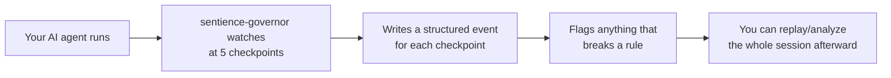

# The package: `sentience-governor`

This page is about the library itself, not this project's use of it — for that, see [Governance wiring](02-governance-wiring.md). Think of this as the "manual" for the tool, written from what we actually found reading its source (`govenenv/Lib/site-packages/sentience_governor/`), not just its marketing docs.

- PyPI: <https://pypi.org/project/sentience-governor/>
- Version used in this project: **0.2.9**
- License: Apache-2.0
- Install: `pip install sentience-governor`

## What it actually is, in plain words

A **flight recorder for AI agents**. It watches an agent's actions — what tools it called, what data it touched, whether it said upfront what it was trying to do — and writes all of that down as a structured, replayable log. It does **not** decide anything and it does **not** stop anything in its free/open version; it only observes and raises flags.



## The five checkpoints ("control points")

Every session is built out of five kinds of moments, each becoming one type of event:

| Checkpoint | Event type | Plain meaning |
|---|---|---|
| 1 | `AGENT_REGISTERED` | "An agent just started up and introduced itself" |
| 2 | `INTENT_DECLARED` | "Here's what this agent says it's trying to do" |
| 3 | `SCOPE_ASSERTED` | "This agent just tried to use a tool / touch something" |
| 4 | `CONTEXT_SNAPSHOT` | "Here's what data just came into view, and how sensitive it is" |
| 5 | `MEMORY_WRITE_ATTEMPT` | "Something just got saved somewhere persistent" |

Every one of these is a small, validated Python object (built with `pydantic`) — not a loose dictionary — so a malformed event can't silently corrupt the log.

## The main classes, and what each one is for

You construct these once per session and pass them to each other — none of them talk to the network or read your filesystem beyond writing the log.

### `SessionManager` (`sentience_governor.session_manager.manager`)

Keeps track of which sessions exist and whether they're active. One instance is meant to be shared across your whole running program (it starts a background thread that auto-closes sessions that go quiet for too long).

```python
sm = SessionManager()
sm.session_start(session_id="abc123", agent_id="my-agent", profile=my_profile)
# ... agent does its work ...
sm.session_end("abc123")
```

- `session_start(session_id, agent_id, profile=None)` — begins a session. `profile` is optional; pass a `GovernanceProfile` if you want custom rules (see below).
- `session_end(session_id)` — closes it.
- `get_profile(session_id)` — look up which profile a running session was started with.

### `InProcessCache` (`sentience_governor.cache.cache`)

Small in-memory scratchpad the library uses to remember things *between* events in the same session — like "what was the sensitivity tier of the last thing this session touched?" You don't call its methods directly much; mostly you just create one and hand it to the pieces below.

```python
cache = InProcessCache()
cache.init_session("abc123")   # call once per session
cache.clear_session("abc123")  # call once, when the session ends
```

This is also where the tier ladder lives: `SENSITIVITY_TIERS = ["public", "internal", "confidential", "pii", "restricted"]` and the helper `max_sensitivity_tier(list_of_labels)` that returns the highest one present.

### `EventBuilder` (`sentience_governor.event_builder.builder`)

**This is the one you actually call the most.** It's the class that turns "something happened" into a validated event, checks it against the rules, and figures out which flags/violations apply. One `EventBuilder` per session.

```python
builder = EventBuilder(
    session_manager=sm,
    cache=cache,
    agent_id="my-agent",
    session_id="abc123",
)
```

Its five factory methods, one per checkpoint:

- **`build_agent_registered(agent_version, vendor_id, declared_capabilities, owner_claim)`** — call once, right after `session_start`. If you leave every field blank (no version, no capabilities, nothing), it flags `POL-002` — an anonymous, unverifiable agent.

- **`build_intent_declared(stated_objective, intent_source, intent_confidence, authorization_claim, session_scope_hint)`** — call once, before the first real action. `session_scope_hint` is a list of the tool/target names this session expects to touch — anything outside that list later on is what trips a scope-mismatch flag.

- **`build_scope_asserted(tool_id, asserted_permissions, target_system, operation_type, authorization_claim=None)`** — call every time a tool is used. `operation_type` is one of `READ`, `WRITE`, `DELETE`, `EXECUTE`. This is the one that can raise `POL-001` (acted without declaring intent, or touched something outside the declared scope).

- **`build_context_snapshot(data_classifications, classification_source, provenance, retention_flags, context_size_tokens, authorization_claim=None)`** — call whenever data comes into view. `data_classifications` is where you say how sensitive this data is (e.g. `["pii"]`) — this is the field that makes sensitivity-escalation detection actually work. If `classification_source` is `"unclassified"`, this raises `POL-003`. If the tier is higher than anything seen before in this session *and* no `authorization_claim` is given, this raises `POL-005`.

- **`build_memory_write_attempt(write_type, detection_mechanism, target_store, write_classification, write_size_tokens, retention_requested)`** — call when something gets saved somewhere persistent (a vector store, a cache, a file used as agent memory). If `write_classification` is `"unclassified"` or `retention_requested` is left as `None`, this raises `POL-004`.

Every one of these returns a `GovernanceEvent` object (or `None` if something was malformed) — call `.to_dict()` on it to get a plain JSON-serializable dict.

### `GovernanceProfile` (`sentience_governor.profile.loader`)

Your own rulebook, loaded from a YAML file. Three things you can tune:

```python
from sentience_governor.profile.loader import GovernanceProfile

profile = GovernanceProfile.from_file("governance/profile.yaml")
result = profile.validate()   # check it's well-formed before using it
print(result.format_human())
```

- `session_intent.demand_at` — when must an agent declare its intent? (`"session_start"`, `"first_write"`, or `"never"`)
- `task_boundary.signals` — what counts as "the agent moved on to a new task"? (e.g. `read_to_write_transition`)
- `high_consequence.tools` — a list of regex patterns; anything matching always gets flagged prominently, no matter what else is going on

Without a profile at all, `GovernanceProfile.defaults()` gives you sensible defaults — passing `profile=None` to `session_start` is completely valid.

### `SinkWriter` / `SinkBase` (`sentience_governor.sink.writer`)

Where the events actually go. `SinkBase` is the interface (just one method: `write(event) -> bool`); the package ships `StdoutSink` (prints to the terminal) and `FileSink` (appends to a file as one JSON line per event). This project writes its own tiny sink that just keeps events in a Python list in memory — see [Governance wiring](02-governance-wiring.md).

```python
sink = SinkWriter(StdoutSink())
sink.write(event, session_id="abc123")
```

`SinkWriter` wraps whichever sink you give it and adds fail-open behavior: if writing ever fails, it logs a warning instead of crashing your agent.

### The analyzers (`sentience_governor.analyze`)

Two plain functions that take a list of event dicts (not the library's own objects — just `[event.to_dict() for event in events]`) and return a summary. Both are pure — they never raise, and they never mutate what you pass in.

```python
from sentience_governor.analyze.undeclared_intent import compute_undeclared_intent_spend
from sentience_governor.analyze.policy_violation_burn_rate import compute_policy_violation_burn_rate

undeclared = compute_undeclared_intent_spend(events)
burn_rate = compute_policy_violation_burn_rate(events)
```

- `compute_undeclared_intent_spend(events)` — how much of the session's work happened outside what was declared upfront.
- `compute_policy_violation_burn_rate(events)` — which policy violations fired, and how much activity is attributable to each.

## The CLI (for reference — this project doesn't use it directly)

The package also ships a command-line tool, mainly built around watching **Claude Code** sessions rather than a custom Python app like this one:

```bash
sentience init claude-code     # wire up Claude Code hooks
sentience status               # is the hook capturing anything?
sentience pulse --latest       # one-command session summary
sentience profile init         # create a governance profile
sentience analyze policy-violations <session>
```

This project doesn't go through the CLI or the Claude Code hook at all — it uses the Python classes above directly, inside a normal LangGraph app.

## The one limitation worth repeating

Every "on_match" behavior the open-source version recognizes is `"flag"` — that's the *only* value it actively supports. `"block"`, `"deny"`, and `"prompt"` are recognized as *reserved* names (so the library won't error if you write them into a profile) but the runtime silently treats them as `"flag"` anyway, because real enforcement is reserved for a future paid tier. If you need something to actually stop happening — like the restricted file in this demo — you write that check yourself. See [Data & access tiers](01-data-access.md) for exactly how this project does that.
