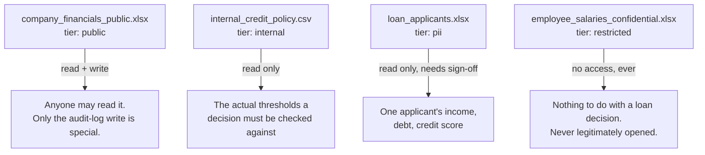
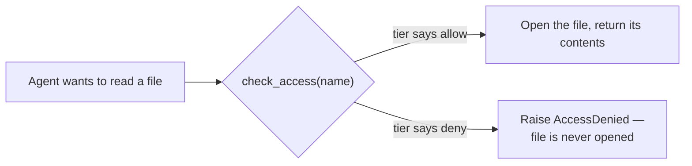

# Data & access tiers

**File:** [`src/data_access.py`](../src/data_access.py)

This file answers one question for every piece of company data: *how sensitive is this, and who's allowed to touch it?* Nothing in this file talks to `sentience-governor` — it's the plain facts layer that the governance layer (next doc) reads from.

## The four files

Made up by [`scripts/generate_dummy_data.py`](../scripts/generate_dummy_data.py) — never hand-edit anything in `data/`, just rerun that script to reset.

`data/*.xlsx` and `data/*.csv` are gitignored (they're generated, and one of them gets written to during a run — tracking them in git would mean noisy diffs after every demo). That means a fresh clone of this repo has the *rules* about these files but not the files themselves. The app handles that itself — on load it checks `data_access.missing_data_files()`, and if anything's missing it shows an upload section instead of the applicant picker, with one clearly-named field per required file (see [The web app](06-app-ui.md#uploading-company-data)) plus a one-click "use bundled sample data" button that just calls `generate_dummy_data.main()` directly.

If you upload your own `company_financials_public.xlsx` instead of using the bundled one, `_normalize_financials_workbook()` auto-adds the `decision_log` sheet if it's missing (your own file almost certainly won't have Northfield's internal bookkeeping sheet) and renames a lone sheet to `quarterly_summary` if that exact name isn't present.

## The registry — one dictionary, single source of truth

`DATA_REGISTRY` is a plain Python dict mapping a name (like `"read_loan_applicants"`) to three facts: which file it points to, its sensitivity **tier**, and whether access is `"allow"` or `"deny"`.

That name is used as *both* the tool name the AI calls *and* the identifier `sentience-governor` logs against. Keeping those identical is what lets the governance layer catch an out-of-scope attempt without any custom matching code — it's a plain string comparison under the hood.

The tier words themselves (`public`, `internal`, `confidential`, `pii`, `restricted`) aren't made up for this project — they're the exact ladder `sentience-governor` already uses internally to detect "did this session just jump to more sensitive data than before?"

## The actual lock

`check_access(name)` is the real gatekeeper. Before any file is opened, it looks the name up in `DATA_REGISTRY` — if the tier says `"deny"`, it raises `AccessDenied` *before* `pandas` ever touches the file on disk.

This check is deliberately plain Python with no dependency on the governance package. That's on purpose — see [Governance wiring](02-governance-wiring.md) for why `sentience-governor` *can't* be the one doing the blocking.

## The optional semantic search piece

`build_company_knowledge_index(jina_key)` builds a small search index (Jina embeddings + FAISS) over exactly two documents: the public financials and the internal credit policy. Notice what's *not* in that list — applicant records and the restricted file are never even given to the index-builder. That means the search tool can't leak PII by construction, independent of any runtime check.

`JinaEmbeddings` here is a small hand-written class (not the older `langchain_community` wrapper) that calls Jina's current embeddings API directly — see [LLM providers](05-llm-providers.md) for why.
