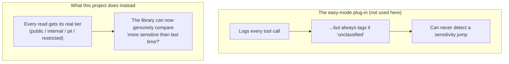
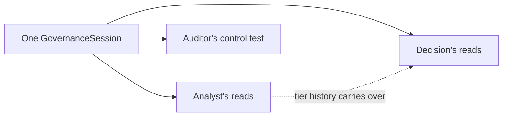
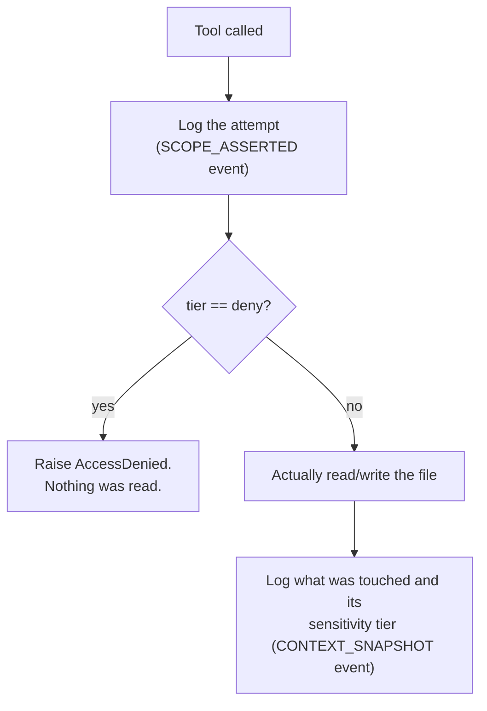

# Governance wiring — talking to `sentience-governor`

**File:** [`src/governance_wiring.py`](../src/governance_wiring.py)

This is the file that actually uses the governance package. Everything else in this project (the agents, the graph, the app) calls into *this* file whenever something needs to be logged or checked.

## Why this file doesn't use the package's "easy mode"

`sentience-governor` ships a ready-made LangChain plug-in (`SentienceCallbackHandler`) that logs tool calls automatically with almost no setup. We tried it first and dropped it, for one concrete reason: it marks *every single thing it logs* as `"unclassified"`. It has no idea that reading public financials is different from reading someone's credit score — so it can never tell the difference between routine and sensitive access, which is the entire point of this demo.

Instead, this file uses the package's lower-level building blocks directly — the same pieces that easy-mode plug-in is built out of — so every read can be tagged with its *real* sensitivity level.

## One session for the whole run, not one per agent

`GovernanceSession` is created **once** per pipeline run and shared by all three agents. This matters: the "did sensitivity just escalate?" check only works by comparing *this* read to the *previous* read in the same session. If each agent got its own session, the Decision agent's read of PII would look like the very first thing that ever happened — no escalation to detect, because there'd be no history to compare against.

## The four things this file records

These map directly to `sentience-governor`'s own event types:

| Method | What it records | When it's called |
|---|---|---|
| `register()` | "This agent exists, here's its name and what it's allowed to touch" | once, at the very start |
| `declare_intent()` | "Here's what this session is trying to do, and the exact list of things it expects to touch" | once, right after registering |
| `access_data()` | "This tool just tried to read/write X, tagged as tier Y" | every single data access |
| `memory_write()` | "The search index just got written to memory" | once, when the Analyst's search index is built |

## `access_data()` — the important one

This is the method every governed tool goes through. It does two things, in order:

1. **Always logs the attempt first** — even if it's about to fail. So a blocked attempt still shows up in the trace; it doesn't disappear.
2. **Then checks the registry** (from [data_access.py](01-data-access.md)) — if the tier says `"deny"`, it raises right there, before the real read/write function is ever called.

Notice: the block in step D is *our* code raising an exception — not the governance package. `sentience-governor`'s free tier can only watch and flag (its own settings file recognizes exactly one behavior on a match: `"flag"` — actual blocking is reserved for a future paid tier). So the log in step B is real either way, but the actual stop only happens because this project's own code checked first.

## The five things that can get flagged

`sentience-governor` ships five built-in policy checks. This project deliberately exercises three of them on purpose, and lets the other two demonstrate *not* firing (which is itself the point — a well-built agent shouldn't trip them):

| Code | Plain meaning | Does it fire in this demo? |
|---|---|---|
| `POL-001` | Touched something outside what was declared upfront | Yes — when the restricted file is attempted |
| `POL-002` | An agent that never properly introduced itself | No — every agent here registers properly |
| `POL-003` | Data was read with no idea how sensitive it is | No — every read here is tagged with its real tier |
| `POL-004` | Something was saved to memory with no sensitivity label | Yes — the search-index build is deliberately left unlabeled, as a live example |
| `POL-005` | Sensitivity jumped up without anyone signing off | Yes — reading PII without the authorization checkbox checked |

See [Reading the output](07-outputs.md) for exactly what each of these looks like on screen.
