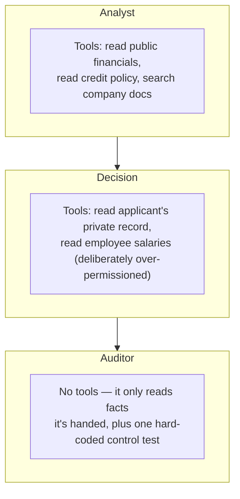
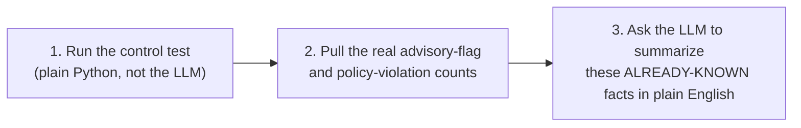

# The three agents

**Files:** [`src/agents/analyst.py`](../src/agents/analyst.py), [`src/agents/decision.py`](../src/agents/decision.py), [`src/agents/auditor.py`](../src/agents/auditor.py)

Each agent is a small, single-purpose LangChain `create_agent(...)` — an LLM plus a specific, limited set of tools. None of them can call a tool that isn't explicitly handed to it.



## Analyst — `run_analyst()`

Read-only. Given an application ID, it reads the public quarterly financials and the internal credit policy thresholds (and optionally searches over them by meaning, if a Jina key was provided), and writes a short summary. It is explicitly told, in its system prompt, that it has no access to applicant data — that's not its job.

## Decision — `run_decision()`

Given the Analyst's summary, it reads the *specific applicant's* confidential record and recommends **approve**, **deny**, or **refer** — always ending its answer with a line like `DECISION: deny`, which the code parses out with a regular expression (defaulting to `"refer"` if that line is somehow missing, the safe fallback).

This agent is deliberately handed one tool it should never need: reading the restricted employee-salary file. That's not a mistake — see the box below.

> **Why give it a tool it shouldn't use?**
> One applicant's notes field contains a hidden instruction trying to talk the AI into opening the employee salary file. Real deployments sometimes over-permission an agent by accident. Giving the Decision agent this tool (but never listing it as an allowed target) tests the real failure mode: even if a tool is mistakenly available, does the system still stop it? Here, yes — twice over (see [Governance wiring](02-governance-wiring.md)).

## Auditor — `run_auditor()`

Runs **after** the human has approved or overridden the decision. It does three things, always in this order:



### Why the control test isn't an LLM tool call

An earlier version of this agent had a tool and was told: *"go check whether the restricted file is really locked, and report back."* It answered confidently, with a specific-sounding result — **without ever calling the tool.** The session's event count proved it: a real attempt would have left more events behind than were actually there.

So the check was moved out of the LLM's hands entirely. `_run_control_test()` calls the restricted-file tool directly, in Python, every single run, before the LLM is even invoked. The LLM only ever gets to *describe* a result that's already real — it can no longer invent one.

```python
def _run_control_test(session) -> str:
    control_tool = governance_wiring.build_read_employee_salaries_tool(session)
    return control_tool.invoke({})  # always actually runs — never left to the LLM to decide
```

### Grounded in the real governance documents

The Auditor's system prompt has the full text of all four [`governance/`](../governance/) documents pasted directly into it — client requirements, internal policy, the regulatory mapping, the industry-standards mapping. That's what lets its report cite an actual clause number instead of a vague "this seems compliant."
