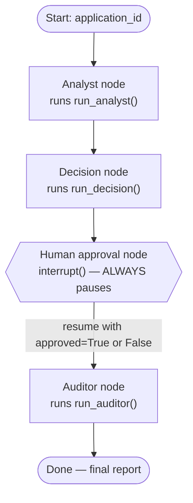
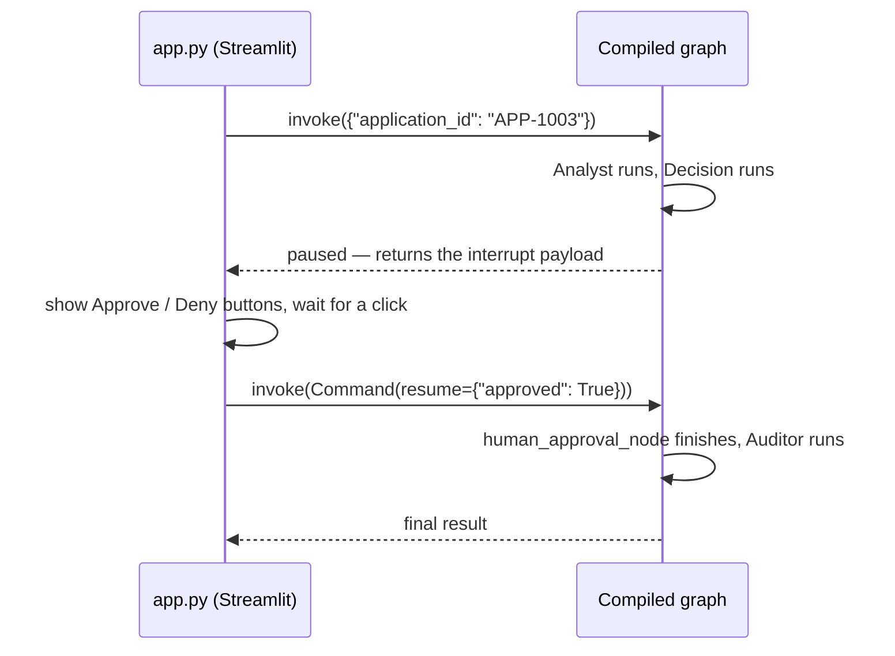

# The pipeline graph

**File:** [`src/graph.py`](../src/graph.py)

This is the LangGraph wiring that connects the three agents in order, with one hard stop for a human in the middle. `build_graph(session, retriever, llms, pii_authorization_claim)` builds and returns the whole thing, compiled and ready to run.



## Why it's one graph, not three separate calls

Wiring the three agents as nodes in a single `StateGraph` (rather than three separate function calls from `app.py`) gets you two things for free:

- A single shared **state** object flows through automatically — the Analyst's summary is just there when the Decision node runs, no manual passing around.
- LangGraph's `interrupt()` can genuinely **pause execution mid-graph** and resume it later, which is what makes the human checkpoint work at all (see below).

## The human checkpoint — the part that can't be skipped

```python
def human_approval_node(state):
    approval = interrupt({
        "application_id": state["application_id"],
        "decision": state["decision"],
        "rationale": state["rationale"],
    })
    return {"human_approved": bool(approval.get("approved", False)), ...}
```

`interrupt(...)` stops the graph in its tracks and hands control back to `app.py`, carrying whatever payload you give it (here: the recommended decision and why). The graph is now frozen — nothing after this point has run yet — until something calls it again with a `Command(resume=...)`.



This isn't a UI trick layered on top — the graph *actually cannot proceed* past this point without that resume call. That's the literal code version of "no autonomous denial": there is no path through this graph that skips the human.

## The checkpointer

`graph.compile(checkpointer=InMemorySaver())` is what makes pausing possible at all — LangGraph needs somewhere to remember "this run is frozen exactly here" between the first `invoke()` and the resuming one. Each run gets its own `thread_id` (this project uses the Sentience session's own ID), so multiple runs never get mixed up.
