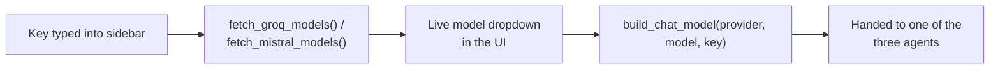

# LLM providers — BYOK

**File:** [`src/llm_providers.py`](../src/llm_providers.py)

Nothing in this project ever reads an API key from `.env` or from disk. Every key comes from what's typed into the Streamlit sidebar for that browser tab, and is passed around as a plain function argument. This file is where a key + a model name turns into an actual LangChain chat model object.



## Why the model list is fetched live, not hardcoded

Groq and Mistral both add and retire models every few months. A hardcoded dropdown goes stale fast — so `fetch_groq_models(api_key)` and `fetch_mistral_models(api_key)` call each provider's own `/models` endpoint with the user's real key and return whatever's actually available *right now*. If the call fails (no key yet, network hiccup), each function falls back to one safe, known-good default — never silently to a fake result.

## Two real bugs this approach caught

Fetching the *real* list surfaced two things a hardcoded list would have hidden:

**1. Not every listed model can actually have a conversation.**
Groq's list includes speech-to-text models (`whisper`), text-to-speech models (`orpheus`/`canopylabs`), and a classifier model (`prompt-guard`, which "answers" a chat message with a bare number instead of a real reply). Mistral's list mixes in embedding, OCR, and moderation models the same way. All of these are filtered out — `_GROQ_NON_CHAT_MARKERS` and `_MISTRAL_NON_CHAT_MARKERS` are just lists of substrings checked against each model's name.

**2. Not every chat model supports tool calling — and every agent here needs it.**
Groq's own `groq/compound` and `groq/compound-mini` are agentic *systems*, not plain chat models — they flatly reject a tool-calling request with an error. This was caught by actually running the app, watching it fail with `` `tool calling` is not supported with this model ``, and testing every borderline model individually before deciding what to filter.

```python
_GROQ_NON_CHAT_MARKERS = ("whisper", "orpheus", "canopylabs", "prompt-guard", "compound")
_MISTRAL_NON_CHAT_MARKERS = ("embed", "ocr", "moderation", "transcribe", "voxtral", "tts")
```

## `build_chat_model(provider, model, api_key, temperature=0.1)`

The one function everything else calls. Raises a clear `ValueError` immediately if the key is blank — better to fail loudly here than get a confusing error three steps later inside a LangGraph node.
