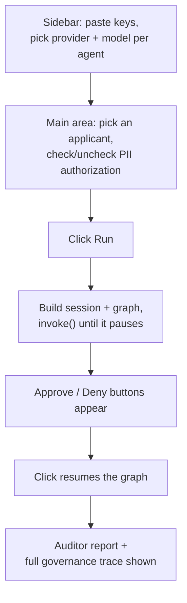

# The web app

**File:** [`app.py`](../app.py)

The Streamlit page that ties everything else together. It doesn't contain any governance logic itself — its job is: collect input, call the graph, show the result.

## The sidebar — BYOK

Three password-type text fields (Groq, Mistral, Jina), plus a provider + model dropdown pair for each of the three agent roles. **Press Enter after typing a key, not Tab** — Streamlit's text input only commits its value to the page's state on Enter or on losing focus in a way Tab doesn't reliably trigger; this tripped up automated testing of this exact page.

## Caching — what's cached and why

Streamlit reruns this entire script top-to-bottom on almost every click. Three things are cached so that doesn't mean redoing real work every time:

| Cached | How | Why |
|---|---|---|
| Groq / Mistral model lists | `st.cache_data(ttl=300)` | Avoid hitting the provider's API on every rerun just to redraw a dropdown that hasn't changed |
| Applicant list + preview | `st.cache_data(ttl=60)` | The applicant file doesn't change at runtime — no reason to re-read it from disk constantly |
| The Jina/FAISS knowledge index | `st.cache_resource(ttl=1800)` | This one's the big one — rebuilding it means real network calls to Jina's embeddings API. Without caching, every single click of "Run" would re-embed the same two documents from scratch. `st.cache_resource` (not `cache_data`) is used here because a retriever is a live object, not copyable data. |

## The BYOK guard before running

Before anything runs, the app checks that a key exists for whichever provider each agent role is set to — if the Analyst is set to Groq but no Groq key was typed in, it stops with a clear message instead of silently trying (and failing) partway through.

## The applicant record preview

Shown *before* you click Run, straight from the raw file — this is the loan officer looking at their own queue, not an agent action, so it deliberately doesn't go through the governance layer at all (see `data_access.preview_applicant()`, called directly, not through `governance_wiring`). If the notes field contains anything that looks like an embedded instruction (`"SYSTEM"` or `"ignore"`), a warning banner explains what that is before you ever click Run.

## The PII authorization checkbox

This is the one input that decides whether the demo shows a clean run or a flagged one. Checking it passes a fixed string like `"loan-officer-authorized:APP-1003"` down to the Decision agent's tool as its `authorization_claim` — see [Governance wiring](02-governance-wiring.md) for what that does to `POL-005`.

## The governance panel (`_render_governance_panel`)

Rendered twice — once at the approval checkpoint (showing what's happened so far), and again at the very end (showing everything, including the Auditor's own control test). It shows, in order: three headline metrics (events / flags / violations), a red or green summary banner, any blocked attempts, the full raw event trace as a table (downloadable as JSON), and the four governance documents in tabs so you can check a flag's citation against the actual source text.
