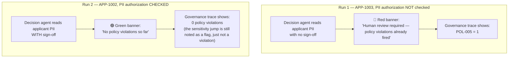

# Reading the output

This page explains what every number, banner, and label you actually see on screen means — written from real runs of this demo, not hypothetical ones.

## The two runs worth comparing

Same question, same applicant-tier data, same code — the only thing that changed is whether a human had already signed off on touching sensitive data. That contrast is the whole demo in one screen.

## The headline metrics

| Metric | What it counts |
|---|---|
| **Events emitted** | Every checkpoint logged this session — registering, declaring intent, every read/write, every memory write. A typical run is around 6–9 events. |
| **Advisory flags** | Things worth noticing, but not necessarily wrong. Can fire even on a fully authorized, compliant run. |
| **Policy violations** | Things that actually broke a declared rule. Zero is the goal; when it's not zero, the report below explains exactly why. |

## The banners

- 🟢 **Green, "no policy violations so far"** — shown at the human-approval checkpoint if nothing has fired yet. This is what a properly-authorized, in-scope run looks like *before* the Auditor's own control test runs (which always adds one thing to check — see below).
- 🔴 **Red, "human review required — policy violations already fired"** — shown with the actual violation dict, e.g. `{'POL-005': 1}`, right at the point a human is being asked to approve or deny. The point: the reviewer sees this *before* deciding, not buried in a report afterward.

## The flags and violations you'll actually see

| Code | Where it comes from in this demo | What it's telling you |
|---|---|---|
| `POL-001` | The Auditor's control test attempting the restricted file | "This target wasn't in the list of things this session said it would touch" |
| `POL-004` | The search-index build, deliberately left unclassified | "Something was saved to memory with no sensitivity label" — a live example, not a bug |
| `POL-005` | Decision agent reading PII with the authorization box unchecked | "Sensitivity jumped up and nobody signed off on it" |
| `SENSITIVITY_ESCALATION` | Any step up the tier ladder, authorized or not | Informational — this is the flag that fires *even when properly authorized*, which is exactly why it's separate from `POL-005` |
| `HIGH_CONSEQUENCE_DETECTED` | Touching the applicant file or the restricted file | Matched against the patterns in `governance/profile.yaml` |
| `TASK_BOUNDARY_CROSSED` | The Auditor's one audit-log write, after a run of reads | "The session just moved from analyzing to acting" |

## Why the Auditor's own run always adds at least one thing

The Auditor always performs its control test — attempting the restricted file — regardless of how clean the rest of the session was. That means even a perfectly authorized, fully-clean Analyst-and-Decision run will show **one `POL-001`** by the time the final report renders, because the control test itself is, by design, an out-of-scope attempt. The Auditor's own report explains this rather than hiding it — that's the "don't overstate what's actually enforced" principle from [Governance wiring](02-governance-wiring.md) applied to its own behavior too.

## The Auditor's compliance report

Plain-English text, but every claim in it should be traceable to something concrete:

- "Blocked access attempt" → traces to `session.blocked_attempts` (a real list, not a guess)
- "Sensitivity escalation" / "Policy violation POL-00X" → traces to the actual flag/violation counts computed by `sentience-governor`'s own analyzers
- "Clause 4 (PII handling)" / "Policy 5 (prompt injection...)" / "EU AI Act..." → traces to the literal text in [`governance/`](../governance/), pasted into the Auditor's prompt so it can't invent a citation

## The full trace table

Every raw event, one row per line: event type, which primitive it was, which tool was involved, any flags, any violations, and the `simulated_consequence` string — `sentience-governor`'s own note on what *would* have happened under real enforcement (e.g. *"This READ operation would have been flagged. The agent must declare intent before operating."*). Downloadable as JSON via the button right below the table — that file is the actual proof artifact you'd hand to a regulator or a client, not a paraphrase of one.
